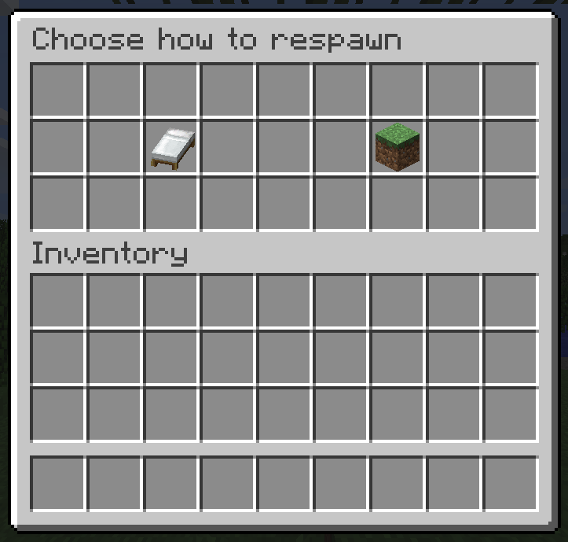
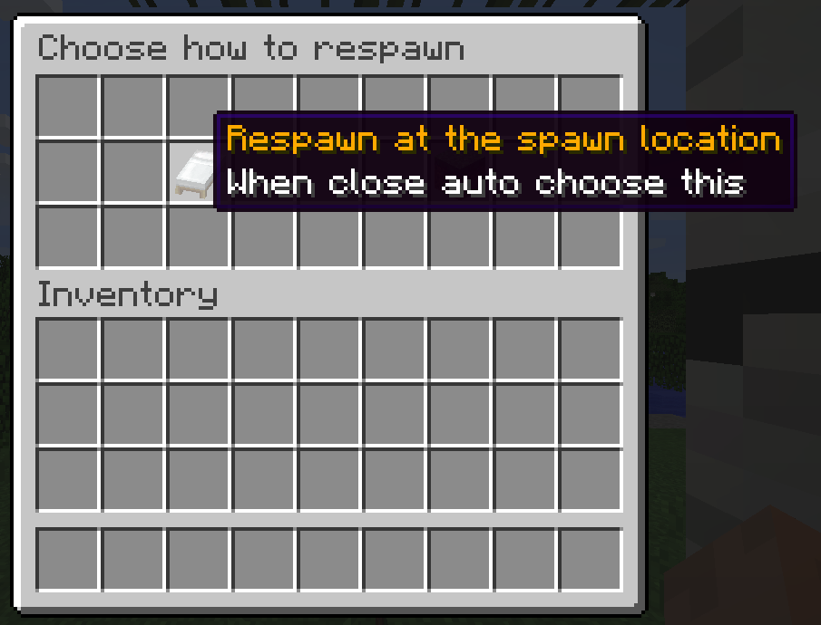
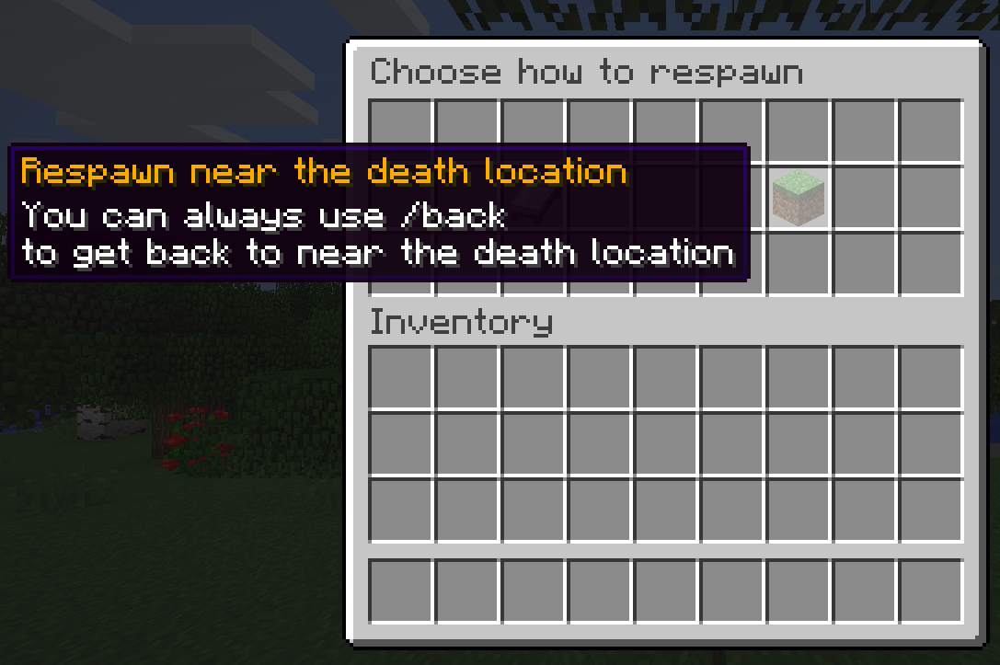
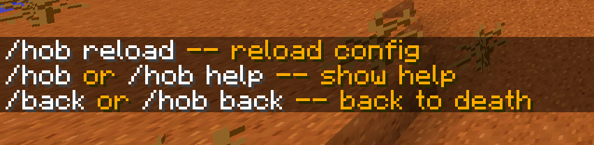
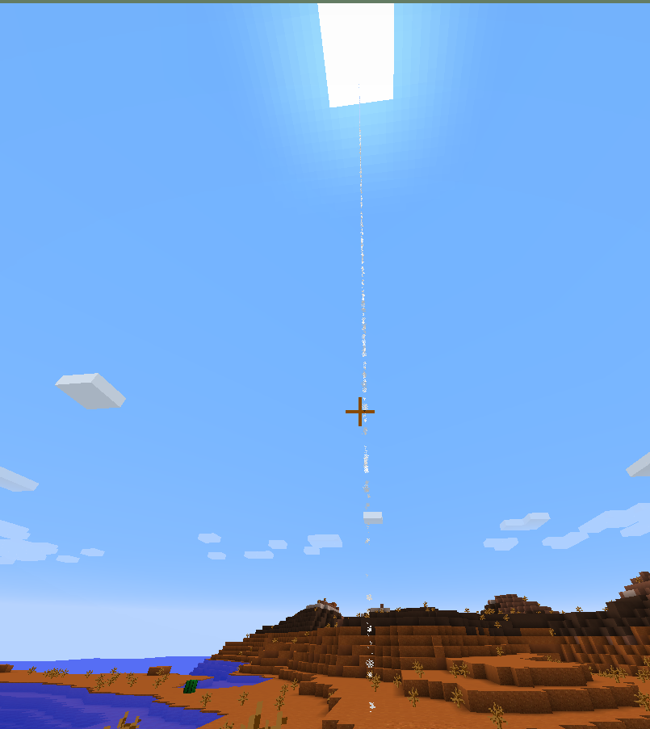

# HomeOrBack
 Show a GUI interface after you die, letting you choose whether to respawn at spawn location or back to the location of death

Features:
- Auto respawn (optional)
- Auto back to death location (optional)
- Display GUI to choose respawn mode (optional)
- Back to the death location (optional)
- Back to the vicinity of the death location (optional)
- Show the location of death (optional)
- Use /back to back the death location (optional)
- Support random teleport of cave world like world_nether
- Support for generating uniform ring random location

# Images






# Config
```yaml
# Default language; English: en, 简体普通话: cmn_Hans, 简体文言文: lzh_Hans
lang: en

# Will not display the death screen
auto_respawn: true
# Set to true to auto back to the place of death after the player dies
auto_back: false

# Back to the random ground near the place of death
back_random:
  enable: true
  # Must > 0
  min: 8
  # Must > min
  max: 32
  # The maximum number of try to generate a random location
  # Must >= 10
  max_try: 100
  # Generate uniformly random location
  uniform: true
  # Generate random location on land as much as possible
  try_to_land: true
  # Never generate random location in the water
  never_water: false

# Use /back to back at any time
back_command: true

# Show death location
show_death_loc: false
```
- The language option is only the default value, and the language file is automatically selected according to the player's language. If the corresponding language file does not exist, the default value is selected.
- If you want to add a cave world like world_nether, just add or modify the "world_name: true" in worlds.yml.
However, the default will automatically judge, based on whether the top layer has bedrock and random sampling


